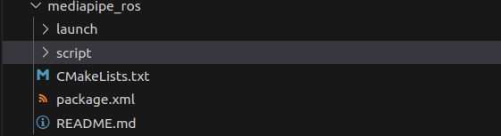

# ROS1报告

## 基础部分

### 地图构建


### 机器人建模


### 移动


### 导航


### 抓取


## 附加部分

### 语音控制

* 在之前的教学过程中，我们学习了在ros下使用科大讯飞，能够产生rostopic: "voiceWakeUp" "voiceWords".
* 控制逻辑是，rostopic pub /voiceWakeUp "message"，之后，就会启动收听模式，并且会将收听到的语音消息转换为文字，发布在“voiceWords”里，在我们自己的包里，创建了car2_voice.cpp，根据“voiceWords”的消息进行判断如何行走

* 运行方式，运行iat_publish(也就是之前的语音转文字)，然后运行car2_voice，最后wakeUp之后，说出消息既可。
* iqt_publish代码,主要的作用是创建了"voiceWakeUp" "voiceWords"节点，wakeup之后，根据语音传文字并发布在“voiceWords”topic.

```cpp
/*
* 语音听写(iFly Auto Transform)技术能够实时地将语音转换成对应的文字。
*/

#include <stdlib.h>
#include <stdio.h>
#include <string.h>
#include <unistd.h>
#include "robot_voice/qisr.h"
#include "robot_voice/msp_cmn.h"
#include "robot_voice/msp_errors.h"
#include "robot_voice/speech_recognizer.h"

#include "ros/ros.h"
#include "std_msgs/String.h"


#define FRAME_LEN	640 
#define	BUFFER_SIZE	4096

int wakeupFlag = 0;
int resultFlag = 0;

/* Upload User words */
static int upload_userwords()
{
	char*			userwords	=	NULL;
	size_t			len			=	0;
	size_t			read_len	=	0;
	FILE*			fp			=	NULL;
	int				ret			=	-1;

	fp = fopen("userwords.txt", "rb");
	if (NULL == fp)										
	{
		printf("\nopen [userwords.txt] failed! \n");
		goto upload_exit;
	}

	fseek(fp, 0, SEEK_END);
	len = ftell(fp); 
	fseek(fp, 0, SEEK_SET);  					
	
	userwords = (char*)malloc(len + 1);
	if (NULL == userwords)
	{
		printf("\nout of memory! \n");
		goto upload_exit;
	}

	read_len = fread((void*)userwords, 1, len, fp); 
	if (read_len != len)
	{
		printf("\nread [userwords.txt] failed!\n");
		goto upload_exit;
	}
	userwords[len] = '\0';
	
	MSPUploadData("userwords", userwords, len, "sub = uup, dtt = userword", &ret); //ÉÏ´«Óû§´Ê±í
	if (MSP_SUCCESS != ret)
	{
		printf("\nMSPUploadData failed ! errorCode: %d \n", ret);
		goto upload_exit;
	}
	
upload_exit:
	if (NULL != fp)
	{
		fclose(fp);
		fp = NULL;
	}	
	if (NULL != userwords)
	{
		free(userwords);
		userwords = NULL;
	}
	
	return ret;
}


static void show_result(char *string, char is_over)
{
	resultFlag = 1;
	printf("\rResult: [ %s ]", string);
	if(is_over)
		putchar('\n');
}

static char *g_result = NULL;
static unsigned int g_buffersize = BUFFER_SIZE;

void on_result(const char *result, char is_last)
{
	if (result) {
		size_t left = g_buffersize - 1 - strlen(g_result);
		size_t size = strlen(result);
		if (left < size) {
			g_result = (char*)realloc(g_result, g_buffersize + BUFFER_SIZE);
			if (g_result)
				g_buffersize += BUFFER_SIZE;
			else {
				printf("mem alloc failed\n");
				return;
			}
		}
		strncat(g_result, result, size);
		show_result(g_result, is_last);
	}
}
void on_speech_begin()
{
	if (g_result)
	{
		free(g_result);
	}
	g_result = (char*)malloc(BUFFER_SIZE);
	g_buffersize = BUFFER_SIZE;
	memset(g_result, 0, g_buffersize);

	printf("Start Listening...\n");
}
void on_speech_end(int reason)
{
	if (reason == END_REASON_VAD_DETECT)
		printf("\nSpeaking done \n");
	else
		printf("\nRecognizer error %d\n", reason);
}

/* demo send audio data from a file */
static void demo_file(const char* audio_file, const char* session_begin_params)
{
	int	errcode = 0;
	FILE*	f_pcm = NULL;
	char*	p_pcm = NULL;
	unsigned long	pcm_count = 0;
	unsigned long	pcm_size = 0;
	unsigned long	read_size = 0;
	struct speech_rec iat;
	struct speech_rec_notifier recnotifier = {
		on_result,
		on_speech_begin,
		on_speech_end
	};

	if (NULL == audio_file)
		goto iat_exit;

	f_pcm = fopen(audio_file, "rb");
	if (NULL == f_pcm)
	{
		printf("\nopen [%s] failed! \n", audio_file);
		goto iat_exit;
	}

	fseek(f_pcm, 0, SEEK_END);
	pcm_size = ftell(f_pcm);
	fseek(f_pcm, 0, SEEK_SET);

	p_pcm = (char *)malloc(pcm_size);
	if (NULL == p_pcm)
	{
		printf("\nout of memory! \n");
		goto iat_exit;
	}

	read_size = fread((void *)p_pcm, 1, pcm_size, f_pcm);
	if (read_size != pcm_size)
	{
		printf("\nread [%s] error!\n", audio_file);
		goto iat_exit;
	}

	errcode = sr_init(&iat, session_begin_params, SR_USER, &recnotifier);
	if (errcode) {
		printf("speech recognizer init failed : %d\n", errcode);
		goto iat_exit;
	}

	errcode = sr_start_listening(&iat);
	if (errcode) {
		printf("\nsr_start_listening failed! error code:%d\n", errcode);
		goto iat_exit;
	}

	while (1)
	{
		unsigned int len = 10 * FRAME_LEN; /* 200ms audio */
		int ret = 0;

		if (pcm_size < 2 * len)
			len = pcm_size;
		if (len <= 0)
			break;

		ret = sr_write_audio_data(&iat, &p_pcm[pcm_count], len);

		if (0 != ret)
		{
			printf("\nwrite audio data failed! error code:%d\n", ret);
			goto iat_exit;
		}

		pcm_count += (long)len;
		pcm_size -= (long)len;		
	}

	errcode = sr_stop_listening(&iat);
	if (errcode) {
		printf("\nsr_stop_listening failed! error code:%d \n", errcode);
		goto iat_exit;
	}

iat_exit:
	if (NULL != f_pcm)
	{
		fclose(f_pcm);
		f_pcm = NULL;
	}
	if (NULL != p_pcm)
	{
		free(p_pcm);
		p_pcm = NULL;
	}

	sr_stop_listening(&iat);
	sr_uninit(&iat);
}

/* demo recognize the audio from microphone */
static void demo_mic(const char* session_begin_params)
{
	int errcode;
	int i = 0;

	struct speech_rec iat;

	struct speech_rec_notifier recnotifier = {
		on_result,
		on_speech_begin,
		on_speech_end
	};

	errcode = sr_init(&iat, session_begin_params, SR_MIC, &recnotifier);
	if (errcode) {
		printf("speech recognizer init failed\n");
		return;
	}
	errcode = sr_start_listening(&iat);
	if (errcode) {
		printf("start listen failed %d\n", errcode);
	}
	/* demo 15 seconds recording */
	while(i++ < 15)
		sleep(1);
	errcode = sr_stop_listening(&iat);
	if (errcode) {
		printf("stop listening failed %d\n", errcode);
	}

	sr_uninit(&iat);
}

void WakeUp(const std_msgs::String::ConstPtr& msg)
{
	printf("waking up\r\n");
	usleep(700*1000);
	wakeupFlag=1;
}

/* main thread: start/stop record ; query the result of recgonization.
 * record thread: record callback(data write)
 * helper thread: ui(keystroke detection)
 */
int main(int argc, char* argv[])
{
	printf("fuck");
	//initialize the ROS
	ros::init(argc,argv,"voiceRecognition");
	ros::NodeHandle n;
	ros::Rate loop_rate(10);

	//declear publisher and subscriber
	ros::Subscriber wakeupSub = n.subscribe("voiceWakeup",1000,WakeUp);
	ros::Publisher voiceWordsPub = n.advertise<std_msgs::String>("voiceWords",1000);

	ROS_INFO("Sleeping...");
	int count = 0;

	//原先科大讯飞代码
	int ret = MSP_SUCCESS;
	int upload_on =	1; /* whether upload the user word */
	/* login params, please do keep the appid correct */
	const char* login_params = "appid = 628d0011, work_dir = .";
	int aud_src = 0; /* from mic or file */

	/*
	* See "iFlytek MSC Reference Manual"
	*/
	const char* session_begin_params =
		"sub = iat, domain = iat, language = zh_cn, "
		"accent = mandarin, sample_rate = 16000, "
		"result_type = plain, result_encoding = utf8";

	/* Login first. the 1st arg is username, the 2nd arg is password
	 * just set them as NULL. the 3rd arg is login paramertes 
	 * */
	ret = MSPLogin(NULL, NULL, login_params);
	if (MSP_SUCCESS != ret)	{
		printf("MSPLogin failed , Error code %d.\n",ret);
		goto exit; // login fail, exit the program
	}

	while(ros::ok())
	{
		printf("reachde here\n");
	// 语音识别唤醒
		if(1)
		{
			printf("Demo recognizing the speech from microphone\n");
			printf("Speak in 8 seconds\n");
			demo_mic(session_begin_params);
			printf("8 sec passed\n");
			wakeupFlag=0;
		}
		// 语音识别完成
		if(resultFlag){
			resultFlag=0;
			std_msgs::String msg;
			msg.data = g_result;
			voiceWordsPub.publish(msg);
		}
		ros::spinOnce();
		loop_rate.sleep();
		count++;
	}
exit:
	MSPLogout(); // Logout...

	return 0;
}

```

* car2_voice.cpp文件，订阅“voiceWords”节点，根据消息判断前后左右运动，从而发布cmd_vel消息。逻辑比较简单

```c++
#include "ros/ros.h"
#include "std_msgs/String.h"
#include "geometry_msgs/Twist.h"

class VoiceCmdVel {
public:
    VoiceCmdVel() {
        // 初始化订阅者和发布者
        sub = n.subscribe("voiceWords", 1000, &VoiceCmdVel::voiceCallback, this);
        pub = n.advertise<geometry_msgs::Twist>("cmd_vel", 10);
    }

    void voiceCallback(const std_msgs::String::ConstPtr& msg) {
        geometry_msgs::Twist vel;
        // 根据接收到的消息调整速度
        if (msg->data.find("前") != std::string::npos) {
            vel.linear.x = 1.0;
        } else if (msg->data.find("后") != std::string::npos) {
            vel.linear.x = -1.0;
        } else if (msg->data.find("左") != std::string::npos) {
            vel.angular.z = 1.0;
        } else if (msg->data.find("右") != std::string::npos) {
            vel.angular.z = -1.0;
        } else {
            // 停止
            vel.linear.x = 0;
            vel.angular.z = 0;
        }
        pub.publish(vel);
    }

private:
    ros::NodeHandle n;
    ros::Subscriber sub;
    ros::Publisher pub;
};

int main(int argc, char **argv) {
    ros::init(argc, argv, "voice_cmd_vel");
    VoiceCmdVel voiceCmdVel;
    ros::spin();
    return 0;
}

```


### mediapipe

* 效果：使用mediapipe进行手势识别，从而根据相应的手势控制小车进行运动

```cpp
git clone https://gitee.com/bingda-robot/mediapipe_ros.git
```

* 大概框架如下



* 我们主要使用hands_gensture.py这个文件

```python
#!/usr/bin/env python
# -*- coding: utf-8 -*-

# 手势分类部分参考博客:https://blog.csdn.net/weixin_45930948/article/details/115444916

import rospy
import cv2
from cv_bridge import CvBridge, CvBridgeError
from sensor_msgs.msg import Image
import mediapipe as mp
import math
from geometry_msgs.msg import Twist
mp_drawing = mp.solutions.drawing_utils
mp_hands = mp.solutions.hands
mp_drawing_styles = mp.solutions.drawing_styles


#!/usr/bin/env python
# -*- coding: utf-8 -*-


class image_converter:
    def __init__(self): 
        self.vel_pub = rospy.Publisher("/cmd_vel", Twist, queue_size=10)
        self.image_pub = rospy.Publisher("hands", Image, queue_size=1)
        self.bridge = CvBridge()
        self.image_sub = rospy.Subscriber("/usb_cam/image_raw", Image, self.callback)
        self.cv_image = []
        self.new_image_flag = False
        while not rospy.is_shutdown():
            with mp_hands.Hands(model_complexity=0,min_detection_confidence=0.5,min_tracking_confidence=0.5) as hands:
                if not self.new_image_flag:
                    continue
                else:
                    self.new_image_flag = False
                    image = self.cv_image
                    # image = cv2.flip(image, 1)
                    # To improve performance, optionally mark the image as not writeable to
                    # pass by reference.
                    image.flags.writeable = False
                    image = cv2.cvtColor(image, cv2.COLOR_BGR2RGB)
                    results = hands.process(image)

                    # Draw the hand annotations on the image.
                    image.flags.writeable = True
                    image = cv2.cvtColor(image, cv2.COLOR_RGB2BGR)
                    if results.multi_hand_landmarks:
                        gesture_counter = 1
                        for hand_landmarks in results.multi_hand_landmarks:
                            mp_drawing.draw_landmarks(
                                image,
                                hand_landmarks,
                                mp_hands.HAND_CONNECTIONS,
                                mp_drawing_styles.get_default_hand_landmarks_style(),
                                mp_drawing_styles.get_default_hand_connections_style())
                            hand_local = []
                            for i in range(21):
                                x = hand_landmarks.landmark[i].x*image.shape[1]
                                y = hand_landmarks.landmark[i].y*image.shape[0]
                                hand_local.append((x,y))
                            if hand_local:
                                angle_list = self.hand_angle(hand_local)
                                gesture_str = self.h_gesture(angle_list)
                                cv2.putText(image,gesture_str,(200*gesture_counter,50),0,2.0,(0,0,255),5)
                                gesture_counter += 1
                try:
                    img_msg = self.bridge.cv2_to_imgmsg(image, "bgr8")
                    img_msg.header.stamp = rospy.Time.now()
                    self.image_pub.publish(img_msg)
                except CvBridgeError as e:
                    print (e)


    def callback(self,data):
        # convert ROS topic to cv image
        try:
            self.cv_image = self.bridge.imgmsg_to_cv2(data, "bgr8")
            self.new_image_flag = True
        except CvBridgeError as e:
            print (e)

    def vector_2d_angle(self,v1,v2):
        '''
            求解二维向量的角度
        '''
        v1_x=v1[0]
        v1_y=v1[1]
        v2_x=v2[0]
        v2_y=v2[1]
        try:
            angle_= math.degrees(math.acos((v1_x*v2_x+v1_y*v2_y)/(((v1_x**2+v1_y**2)**0.5)*((v2_x**2+v2_y**2)**0.5))))
        except:
            angle_ =65535.
        if angle_ > 180.:
            angle_ = 65535.
        return angle_
    def hand_angle(self,hand_):
        '''
            获取对应手相关向量的二维角度,根据角度确定手势
        '''
        angle_list = []
        #---------------------------- thumb 大拇指角度
        angle_ = self.vector_2d_angle(
            ((int(hand_[0][0])- int(hand_[2][0])),(int(hand_[0][1])-int(hand_[2][1]))),
            ((int(hand_[3][0])- int(hand_[4][0])),(int(hand_[3][1])- int(hand_[4][1])))
            )
        angle_list.append(angle_)
        #---------------------------- index 食指角度
        angle_ = self.vector_2d_angle(
            ((int(hand_[0][0])-int(hand_[6][0])),(int(hand_[0][1])- int(hand_[6][1]))),
            ((int(hand_[7][0])- int(hand_[8][0])),(int(hand_[7][1])- int(hand_[8][1])))
            )
        angle_list.append(angle_)
        #---------------------------- middle 中指角度
        angle_ = self.vector_2d_angle(
            ((int(hand_[0][0])- int(hand_[10][0])),(int(hand_[0][1])- int(hand_[10][1]))),
            ((int(hand_[11][0])- int(hand_[12][0])),(int(hand_[11][1])- int(hand_[12][1])))
            )
        angle_list.append(angle_)
        #---------------------------- ring 无名指角度
        angle_ = self.vector_2d_angle(
            ((int(hand_[0][0])- int(hand_[14][0])),(int(hand_[0][1])- int(hand_[14][1]))),
            ((int(hand_[15][0])- int(hand_[16][0])),(int(hand_[15][1])- int(hand_[16][1])))
            )
        angle_list.append(angle_)
        #---------------------------- pink 小拇指角度
        angle_ = self.vector_2d_angle(
            ((int(hand_[0][0])- int(hand_[18][0])),(int(hand_[0][1])- int(hand_[18][1]))),
            ((int(hand_[19][0])- int(hand_[20][0])),(int(hand_[19][1])- int(hand_[20][1])))
            )
        angle_list.append(angle_)
        return angle_list

    def h_gesture(self,angle_list):
        '''
            # 二维约束的方法定义手势
            # fist five gun love one six three thumbup yeah
        '''

        thr_angle_curve = 49.
        thr_angle_straighten = 65.0
        gesture_str = None
        if 65535. not in angle_list:
            if (angle_list[0]>thr_angle_straighten)  and (angle_list[1]<thr_angle_curve) and (angle_list[2]>thr_angle_straighten) and (angle_list[3]>thr_angle_straighten) and (angle_list[4]>thr_angle_straighten):
                gesture_str = "one"

            elif (angle_list[0]>thr_angle_straighten) and (angle_list[1]<thr_angle_curve) and (angle_list[2]<thr_angle_curve) and (angle_list[3]>thr_angle_straighten) and (angle_list[4]>thr_angle_straighten):
                gesture_str = "two"   
            elif (angle_list[0]>thr_angle_straighten) and (angle_list[1]<thr_angle_curve) and (angle_list[2]<thr_angle_curve) and (angle_list[3]<thr_angle_curve) and (angle_list[4]>thr_angle_straighten):
                gesture_str = "three"      
            elif (angle_list[0]>thr_angle_straighten) and (angle_list[1]>thr_angle_straighten) and (angle_list[2]<thr_angle_curve) and (angle_list[3]<thr_angle_curve) and (angle_list[4]<thr_angle_curve):
                gesture_str = "three"     
            elif (angle_list[0]>thr_angle_straighten) and (angle_list[1]<thr_angle_curve) and (angle_list[2]<thr_angle_curve) and (angle_list[3]<thr_angle_curve) and (angle_list[4]<thr_angle_curve):
                gesture_str = "four"                           
            elif (angle_list[0]<thr_angle_curve) and (angle_list[1]<thr_angle_curve) and (angle_list[2]<thr_angle_curve) and (angle_list[3]<thr_angle_curve) and (angle_list[4]<thr_angle_curve):
                gesture_str = "five"
            elif (angle_list[0]<thr_angle_curve)  and (angle_list[1]>thr_angle_straighten) and (angle_list[2]>thr_angle_straighten) and (angle_list[3]>thr_angle_straighten) and (angle_list[4]<thr_angle_curve):
                gesture_str = "six"
            elif (angle_list[0]<thr_angle_curve)  and (angle_list[1]>thr_angle_straighten) and (angle_list[2]>thr_angle_straighten) and (angle_list[3]>thr_angle_straighten) and (angle_list[4]>thr_angle_straighten):
                gesture_str = "Good"
            elif (angle_list[0]>thr_angle_straighten) and (angle_list[1]>thr_angle_straighten) and (angle_list[2]<thr_angle_curve) and (angle_list[3]>thr_angle_straighten) and (angle_list[4]>thr_angle_straighten):
                gesture_str = "F**K"


            # 根据手势设置速度和角度
        twist = Twist()
        if gesture_str == "one":
            twist.linear.x = 0.5  # 向前移动
        elif gesture_str == "two":
            twist.linear.x = -0.5 # 向后移动
        elif gesture_str == "three":
            twist.angular.z = 2.0 # 向左转
        elif gesture_str == "four":
            twist.angular.z = -2.0 # 向右转
        elif gesture_str == "Good":
            twist.linear.x = 2.0 # 加速
        elif gesture_str == "six":
            twist.linear.x = 0.0  # 停止
            twist.angular.z = 5.0
        elif gesture_str == "F**K":
            twist.linear.x = 0.0  # 停止
            twist.angular.z = 0.0
        else:
            twist.linear.x = 0.0   # 停止
            twist.angular.z = 0.0
        print(f"twist x is: {twist.linear.x} twist z is: {twist.angular.z}")
        # 发布速度命令
        twist.linear.y = 0
        twist.linear.z = 0
        twist.angular.x = 0
        twist.angular.y = 0
        self.vel_pub.publish(twist)

        return gesture_str


if __name__ == '__main__':
    try:
        # 初始化ros节点
        rospy.init_node("pose")
        rospy.loginfo("Starting pose node")
        image_converter()
        rospy.spin()
    except KeyboardInterrupt:
        print ("Shutting down pose node.")
        cv2.destroyAllWindows()


```

* 在这里使用mediapipe，获取关节点

```python
if results.multi_hand_landmarks:
                        gesture_counter = 1
                        for hand_landmarks in results.multi_hand_landmarks:
                            mp_drawing.draw_landmarks(
                                image,
                                hand_landmarks,
                                mp_hands.HAND_CONNECTIONS,
                                mp_drawing_styles.get_default_hand_landmarks_style(),
                                mp_drawing_styles.get_default_hand_connections_style())
                            hand_local = []
                            for i in range(21):
                                x = hand_landmarks.landmark[i].x*image.shape[1]
                                y = hand_landmarks.landmark[i].y*image.shape[0]
                                hand_local.append((x,y))
                            if hand_local:
                                angle_list = self.hand_angle(hand_local)
                                gesture_str = self.h_gesture(angle_list)
                                cv2.putText(image,gesture_str,(200*gesture_counter,50),0,2.0,(0,0,255),5)
                                gesture_counter += 1
```

* 在**hand_angle**函数里面，处理关节点的位置，从而获取各个手指的角度

```python
angle_list = []
        #---------------------------- thumb 大拇指角度
        angle_ = self.vector_2d_angle(
            ((int(hand_[0][0])- int(hand_[2][0])),(int(hand_[0][1])-int(hand_[2][1]))),
            ((int(hand_[3][0])- int(hand_[4][0])),(int(hand_[3][1])- int(hand_[4][1])))
            )
        angle_list.append(angle_)
        #---------------------------- index 食指角度
        angle_ = self.vector_2d_angle(
            ((int(hand_[0][0])-int(hand_[6][0])),(int(hand_[0][1])- int(hand_[6][1]))),
            ((int(hand_[7][0])- int(hand_[8][0])),(int(hand_[7][1])- int(hand_[8][1])))
            )
        angle_list.append(angle_)
        #---------------------------- middle 中指角度
        angle_ = self.vector_2d_angle(
            ((int(hand_[0][0])- int(hand_[10][0])),(int(hand_[0][1])- int(hand_[10][1]))),
            ((int(hand_[11][0])- int(hand_[12][0])),(int(hand_[11][1])- int(hand_[12][1])))
            )
        angle_list.append(angle_)
        #---------------------------- ring 无名指角度
        angle_ = self.vector_2d_angle(
            ((int(hand_[0][0])- int(hand_[14][0])),(int(hand_[0][1])- int(hand_[14][1]))),
            ((int(hand_[15][0])- int(hand_[16][0])),(int(hand_[15][1])- int(hand_[16][1])))
            )
        angle_list.append(angle_)
        #---------------------------- pink 小拇指角度
        angle_ = self.vector_2d_angle(
            ((int(hand_[0][0])- int(hand_[18][0])),(int(hand_[0][1])- int(hand_[18][1]))),
            ((int(hand_[19][0])- int(hand_[20][0])),(int(hand_[19][1])- int(hand_[20][1])))
            )
        angle_list.append(angle_)
```

* 在**h_gensture**函数中，通过手指的角度来进行判断手势

```python
if (angle_list[0]>thr_angle_straighten)  and (angle_list[1]<thr_angle_curve) and (angle_list[2]>thr_angle_straighten) and (angle_list[3]>thr_angle_straighten) and (angle_list[4]>thr_angle_straighten):
                gesture_str = "one"

            elif (angle_list[0]>thr_angle_straighten) and (angle_list[1]<thr_angle_curve) and (angle_list[2]<thr_angle_curve) and (angle_list[3]>thr_angle_straighten) and (angle_list[4]>thr_angle_straighten):
                gesture_str = "two"   
            elif (angle_list[0]>thr_angle_straighten) and (angle_list[1]<thr_angle_curve) and (angle_list[2]<thr_angle_curve) and (angle_list[3]<thr_angle_curve) and (angle_list[4]>thr_angle_straighten):
                gesture_str = "three"      
            elif (angle_list[0]>thr_angle_straighten) and (angle_list[1]>thr_angle_straighten) and (angle_list[2]<thr_angle_curve) and (angle_list[3]<thr_angle_curve) and (angle_list[4]<thr_angle_curve):
                gesture_str = "three"     
            elif (angle_list[0]>thr_angle_straighten) and (angle_list[1]<thr_angle_curve) and (angle_list[2]<thr_angle_curve) and (angle_list[3]<thr_angle_curve) and (angle_list[4]<thr_angle_curve):
                gesture_str = "four"                           
            elif (angle_list[0]<thr_angle_curve) and (angle_list[1]<thr_angle_curve) and (angle_list[2]<thr_angle_curve) and (angle_list[3]<thr_angle_curve) and (angle_list[4]<thr_angle_curve):
                gesture_str = "five"
            elif (angle_list[0]<thr_angle_curve)  and (angle_list[1]>thr_angle_straighten) and (angle_list[2]>thr_angle_straighten) and (angle_list[3]>thr_angle_straighten) and (angle_list[4]<thr_angle_curve):
                gesture_str = "six"
            elif (angle_list[0]<thr_angle_curve)  and (angle_list[1]>thr_angle_straighten) and (angle_list[2]>thr_angle_straighten) and (angle_list[3]>thr_angle_straighten) and (angle_list[4]>thr_angle_straighten):
                gesture_str = "Good"
            elif (angle_list[0]>thr_angle_straighten) and (angle_list[1]>thr_angle_straighten) and (angle_list[2]<thr_angle_curve) and (angle_list[3]>thr_angle_straighten) and (angle_list[4]>thr_angle_straighten):
                gesture_str = "F**K"
```

* 最后，根据我们的手势来发布相应的cmd_veltopic下的Twist消息

```python
    # 根据手势设置速度和角度
        twist = Twist()
        if gesture_str == "one":
            twist.linear.x = 0.5  # 向前移动
        elif gesture_str == "two":
            twist.linear.x = -0.5 # 向后移动
        elif gesture_str == "three":
            twist.angular.z = 2.0 # 向左转
        elif gesture_str == "four":
            twist.angular.z = -2.0 # 向右转
        elif gesture_str == "Good":
            twist.linear.x = 2.0 # 加速
        elif gesture_str == "six":
            twist.linear.x = 0.0  # 停止
            twist.angular.z = 5.0
        elif gesture_str == "F**K":
            twist.linear.x = 0.0  # 停止
            twist.angular.z = 0.0
        else:
            twist.linear.x = 0.0   # 停止
            twist.angular.z = 0.0
        print(f"twist x is: {twist.linear.x} twist z is: {twist.angular.z}")
        # 发布速度命令
        twist.linear.y = 0
        twist.linear.z = 0
        twist.angular.x = 0
        twist.angular.y = 0
        self.vel_pub.publish(twist)
```

## typora 使用

1. #加上空格代表多少层级

##### 这是第五层

2. *加上空格

* 这就是效果

3. ctrl + shift + k,代码行

```

```

